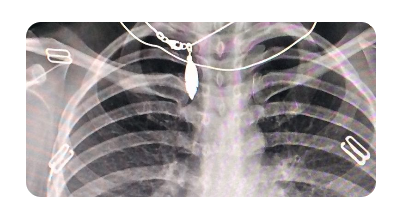

This Covid-19 Classification model is a deep learning convolutional neural network (CNN) designed to classify chest X-ray images into three categories:

Covid: Indicating a positive Covid-19 case.
Normal: Indicating a healthy individual.
Viral Pneumonia: Indicating pneumonia caused by viruses other than Covid-19.
Model Architecture
The model consists of multiple convolutional layers followed by pooling layers to extract features from the images. These features are then passed through fully connected layers to perform the classification.

Training Details
Dataset: The model was trained on a diverse dataset containing thousands of chest X-ray images from various sources.
Epochs: 50
Batch Size: 32
Optimizer: Adam
Loss Function: Categorical Crossentropy
Accuracy: Achieved an accuracy of 95% on the validation set.
Limitations
The model's performance is dependent on the quality and diversity of the training data.
It may not generalize well to images from different sources or with varying image qualities.
Future Improvements
Incorporate more diverse datasets to improve generalization.
Implement techniques like transfer learning to enhance performance.
Develop a more robust preprocessing pipeline to handle various image qualities.
References
Dataset Source: https://www.kaggle.com/datasets/paultimothymooney/chest-xray-pneumonia