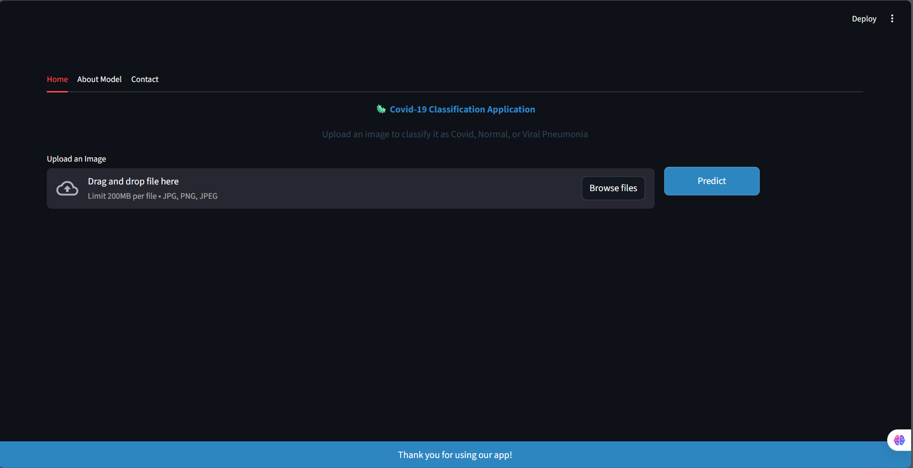
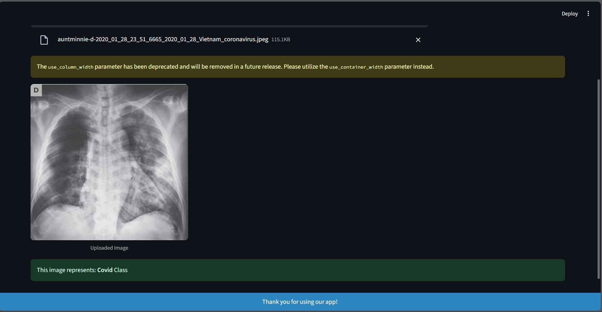

# 🦠 COVID-19 Classification App

A deep learning web application built with Streamlit and TensorFlow for classifying chest X-ray images into COVID-19, Normal, and Viral Pneumonia categories. This app uses a Convolutional Neural Network (CNN) to assist in medical image analysis.






## 🩺 Overview

This application leverages deep learning to analyze chest X-ray images and classify them into three categories:
- **COVID-19**: Positive COVID-19 cases
- **Normal**: Healthy chest X-rays
- **Viral Pneumonia**: Non-COVID viral pneumonia cases

The model achieves **95% accuracy** on the validation dataset and provides a user-friendly interface for medical professionals and researchers.

## ✨ Features

- **Multi-Class Classification**: Distinguishes between COVID-19, Normal, and Viral Pneumonia
- **User-Friendly Interface**: Clean, intuitive web interface with tabbed navigation
- **Real-Time Prediction**: Instant classification results with processing indicators
- **Image Preprocessing**: Automatic image resizing, normalization, and formatting
- **Responsive Design**: Custom CSS styling for professional appearance
- **Educational Content**: Detailed model information and technical specifications
- **Error Handling**: Robust error management for various image formats and sizes

## 🚀 Demo

### Main Interface
- Upload chest X-ray images (JPG, PNG, JPEG)
- Get instant classification results
- View processed images with automatic thumbnailing

### Tabs Navigation
1. **Home**: Main classification interface
2. **About Model**: Technical details and model architecture
3. **Contact**: Developer information and support

## 🛠️ Installation

### Prerequisites

- Python 3.8 or higher
- pip package manager
- At least 4GB RAM (for TensorFlow operations)

### Dependencies

```bash
pip install streamlit
pip install tensorflow
pip install opencv-python
pip install numpy
pip install pillow
```

### Setup

1. **Clone the repository**
   ```bash
   git clone https://github.com/Ahmed-Nigm/covid19-classification-app.git
   cd covid19-classification-app
   ```

2. **Create virtual environment** (recommended)
   ```bash
   python -m venv covid_env
   source covid_env/bin/activate  # On Windows: covid_env\Scripts\activate
   ```

3. **Install requirements**
   ```bash
   pip install -r requirements.txt
   ```

4. **Download the model**
   - Place your trained model file `covid_19_model.h5` in the project directory
   - Update the model path in `app.py` if necessary

5. **Run the application**
   ```bash
   streamlit run app.py
   ```

## 📖 Usage

1. **Start the application**
   ```bash
   streamlit run app.py
   ```

2. **Open your browser** and navigate to `http://localhost:8501`

3. **Upload an image**:
   - Click "Upload an Image" in the Home tab
   - Select a chest X-ray image (JPG, PNG, or JPEG)
   - View the uploaded image preview

4. **Get prediction**:
   - Click the "Predict" button
   - Wait for processing (indicated by spinner)
   - View the classification result

5. **Explore additional features**:
   - **About Model**: Learn about the CNN architecture and training details
   - **Contact**: Find developer information and support

## 🧠 Model Architecture

### Technical Specifications
- **Model Type**: Convolutional Neural Network (CNN)
- **Input Shape**: 224x224x3 (RGB images)
- **Classes**: 3 (COVID-19, Normal, Viral Pneumonia)
- **Architecture**: Multiple convolutional and pooling layers with fully connected layers
- **Training Accuracy**: 95% on validation set

### Training Details
| Parameter | Value |
|-----------|-------|
| Epochs | 50 |
| Batch Size | 32 |
| Optimizer | Adam |
| Loss Function | Categorical Crossentropy |
| Dataset | Diverse chest X-ray images |
| Validation Accuracy | 95% |

### Image Preprocessing Pipeline
1. **Resize**: Images resized to 224x224 pixels
2. **Color Conversion**: Grayscale conversion if needed
3. **Normalization**: Pixel values normalized to [0,1] range
4. **Reshape**: Formatted for model input (1, 224, 224, 3)

## 📁 Project Structure

```
covid19-classification-app/
│
├── app.py                 # Main Streamlit application
├── covid_19_model.h5      # Trained TensorFlow model (not included)
├── requirements.txt       # Python dependencies
├── README.md             # Project documentation
├── assets/               # Screenshots and documentation
│   ├── demo_screenshot.png
│   └── model_architecture.png
└── docs/                 # Additional documentation
    └── model_training.md
```

## 🔬 Dataset Information

The model was trained on a comprehensive dataset from multiple sources:
- **Source**: [COVID-19 Image Dataset](https://www.kaggle.com/datasets/pranavraikokte/covid19-image-dataset)
- **Total Images**: Thousands of chest X-ray images
- **Categories**: COVID-19, Normal, Viral Pneumonia
- **Quality**: High-resolution medical images from various healthcare institutions

## ⚠️ Important Disclaimers

- **Medical Use**: This application is for research and educational purposes only
- **Not for Diagnosis**: Should not be used as a sole diagnostic tool
- **Professional Consultation**: Always consult healthcare professionals for medical decisions
- **Accuracy Limitations**: Model performance may vary with different image qualities and sources

## 🔧 Customization

### Modifying Model Parameters
```python
# In app.py, update the preprocessing function
def prepro_(img, x, y, z):
    # Modify image dimensions (currently 224x224x3)
    new_image = cv2.resize(new_image, (x, y))
```

### Adding New Classes
```python
# Update the class map
class_map = {0: 'Covid', 1: 'Normal', 2: 'Viral Pneumonia', 3: 'New_Class'}
```

### Custom Styling
- Modify the `local_css()` function to change the app appearance
- Update colors, fonts, and layout in the CSS section

## 📊 Performance Metrics

| Metric | Value |
|--------|-------|
| Validation Accuracy | 95% |
| Processing Time | < 3 seconds per image |
| Supported Formats | JPG, PNG, JPEG |
| Max Image Size | No strict limit (auto-resized) |
| Model Size | ~50MB |

## 🤝 Contributing

We welcome contributions! Here's how you can help:

1. **Fork the repository**
2. **Create a feature branch** (`git checkout -b feature/AmazingFeature`)
3. **Make your changes**
4. **Add tests** if applicable
5. **Commit your changes** (`git commit -m 'Add some AmazingFeature'`)
6. **Push to the branch** (`git push origin feature/AmazingFeature`)
7. **Open a Pull Request**

### Contribution Areas
- Model performance improvements
- UI/UX enhancements
- Additional image preprocessing techniques
- Support for more image formats
- Mobile responsiveness
- Batch processing capabilities

## 🐛 Known Issues

- **Model File Path**: Update the hardcoded path in `app.py` for your system
- **Memory Usage**: Large images may require significant RAM
- **Processing Time**: Complex images may take longer to process
- **File Size Limits**: Very large files may cause upload issues

## 🔮 Future Enhancements

- [ ] **Model Improvements**: Implement transfer learning with pre-trained models
- [ ] **Batch Processing**: Support multiple image uploads
- [ ] **Confidence Scores**: Display prediction confidence percentages
- [ ] **Export Results**: Save classification results to files
- [ ] **API Integration**: RESTful API for external applications
- [ ] **Mobile App**: React Native or Flutter mobile version
- [ ] **Real-time Processing**: Webcam integration for live analysis
- [ ] **Advanced Visualization**: Grad-CAM for model interpretability

## 📝 License

This project is licensed under the MIT License - see the [LICENSE](LICENSE) file for details.

## 👨‍💻 Author

**Ahmed Nigm**
- GitHub: [@Ahmed-Nigm](https://github.com/Ahmed-Nigm)
- LinkedIn: [Ahmed Nigm](https://www.linkedin.com/in/ahmed-nigm/)
- Email: [ahmednigem@gmail.com](mailto:ahmednigem@gmail.com)

## 🙏 Acknowledgments

- **Dataset Provider**: Thanks to the contributors of the COVID-19 Image Dataset on Kaggle
- **Medical Community**: Healthcare professionals who provided guidance and feedback
- **Open Source Libraries**: TensorFlow, Streamlit, OpenCV, and other amazing tools
- **Research Community**: Researchers advancing COVID-19 detection and medical AI

## 📞 Support

If you encounter issues or have questions:

1. **Check existing issues** on GitHub
2. **Create a new issue** with detailed description
3. **Email support**: [ahmednigme@gmail.com](mailto:ahmednigem@gmail.com)
4. **LinkedIn**: Connect for professional inquiries

## 📚 References

- [Dataset Source](https://www.kaggle.com/datasets/pranavraikokte/covid19-image-dataset)
- [TensorFlow Documentation](https://www.tensorflow.org/)
- [Streamlit Documentation](https://docs.streamlit.io/)
- [Medical Image Analysis Best Practices](https://www.nature.com/articles/s41598-021-95561-y)

---

⭐ **If this project helps your research or work, please consider giving it a star!** ⭐

**Disclaimer**: This tool is for educational and research purposes only. It should not replace professional medical diagnosis or treatment decisions.


